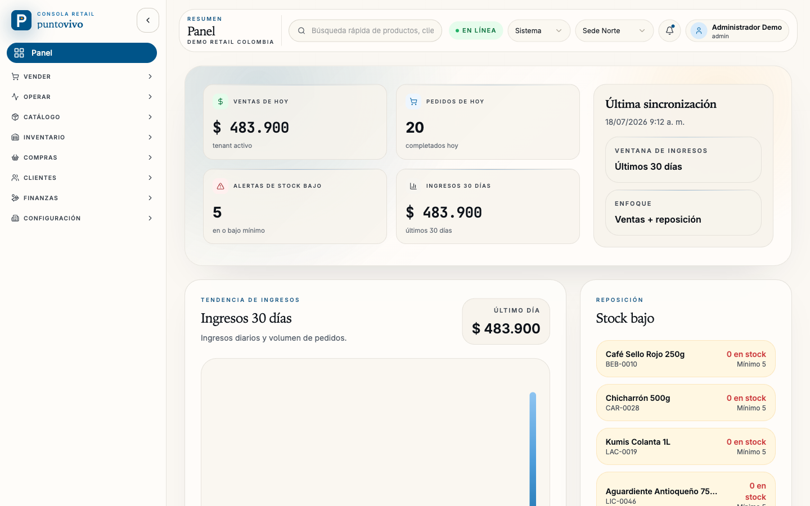
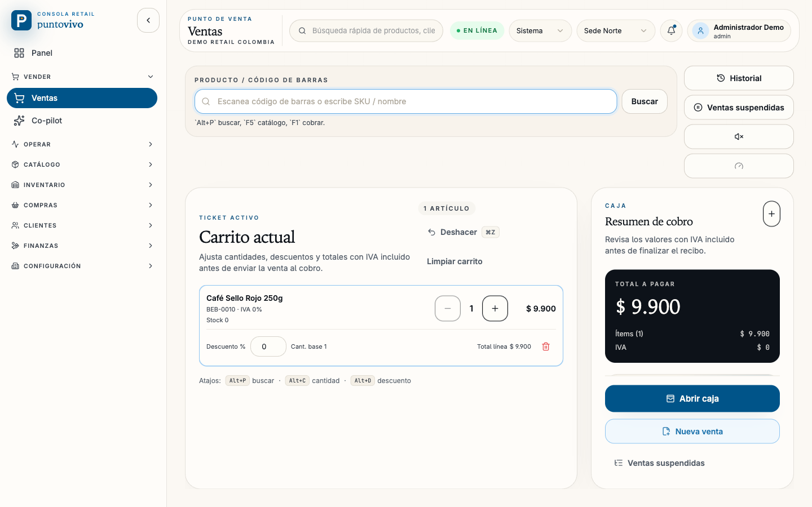
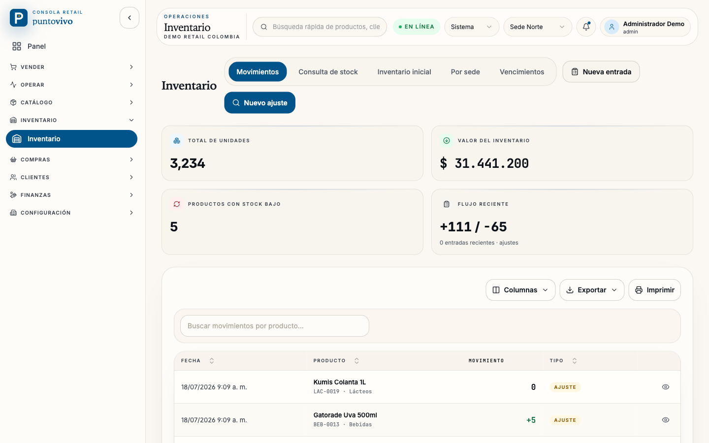
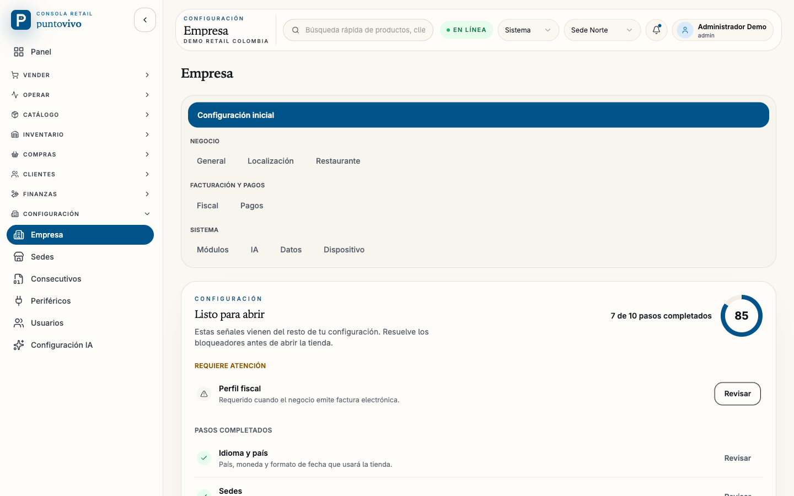

<div align="center">


# Puntovivo

### Local-first, fiscal-native POS for Latin American retail

Fast checkout, cash accountability, site-owned stock, and fiscal readiness —
running on local SQLite authority with offline operation, before any cloud
dependency.

[](./LICENSE)
[](https://github.com/johnny4young/puntovivo/actions/workflows/ci.yml)
[](./package.json)
[](./apps/desktop)
[](./apps/web)
[](./packages/server)

<br />



</div>

---

## What is Puntovivo

Puntovivo is a point-of-sale system for Latin American retail operators. The
first sellable wedge is **Colombia retail for 1–10 site stores**: fast
checkout, cash accountability, site-owned stock, auditability, and fiscal
readiness — with the local database as the source of truth so the store keeps
selling even when the network does not.

It runs the same React app in two targets — an **Electron desktop** app and a
**browser** app — over an embedded **Fastify + tRPC** API. On desktop the
server runs in-process inside the Electron main process, and all data lives in
an encrypted local **SQLite** database.

It is deliberately **not** a generic ERP, not a cloud-only suite, and not
trying to ship every vertical at once. Restaurant, KDS, AI, delivery, public
API, and hosted SaaS exist as modules or roadmap lanes — the production gate is
retail POS sellability.

## Highlights

- 🧾 **Fiscal-native from the ground up** — tenant fiscal profiles, DIAN
  identification catalogs, NIT verification-digit validation, receipt
  templates, and a durable fiscal outbox. The document, its numbering
  advance, and the outbox enqueue commit in a single write transaction.
- 🛒 **Barcode-first checkout** — scan or type SKU, keyboard-driven cart
  (`Alt+P` search, `Alt+C` quantity, `Alt+D` discount), suspended sales, and
  a live IVA-inclusive payment summary.
- 💵 **Cash accountability** — one open cash session per register, blind or
  sighted close, movement ledger with an expected-balance invariant, and a
  60-second day-close ritual with real gross margin and a reconciliation
  traffic light.
- 📦 **Site-owned inventory** — per-site stock authority, a materialized stock
  rollup maintained by SQLite triggers, FEFO lot tracking, and an expiry radar
  that surfaces value-at-risk before shrinkage happens. Variant matrices,
  serialized logistics, warranty lookup, and exact inter-site transfers are
  part of the same inventory model.
- 👥 **Workforce and loss prevention** — shared-terminal staff switching,
  schedules, attendance evidence, corrections, overtime classification,
  manager approval grants, and auditable site-level alerts.
- 💾 **Operational recovery** — encrypted storage, encrypted backup bundles,
  scheduled snapshots, restore drills, S3-compatible cloud-vault upload,
  privacy disposition, retention controls, and guided launch imports.
- 🔒 **Multi-tenant by construction** — every query is tenant-scoped, role
  guards and site-scope guards are shared primitives, and cross-tenant
  isolation is pinned by tests.
- 🌎 **Bilingual, offline-first** — neutral Latin American Spanish and English
  UI, local SQLite authority, and a durable outbox/sync kernel for eventual
  cloud replication.

## Screenshots

<div align="center">

|                                                                     Point of sale                                                                      |                                                                          Inventory                                                                           |
| :----------------------------------------------------------------------------------------------------------------------------------------------------: | :----------------------------------------------------------------------------------------------------------------------------------------------------------: |
|            |  |
|                                                           **Guided setup & fiscal profile**                                                            |                                                                                                                                                              |
|  |                                                                                                                                                              |

</div>

> The interface is shown in Spanish — Puntovivo ships neutral Latin American
> Spanish and English, switchable per user.

## Current Status

Puntovivo is under active development. Honest gates:

| Stage                    | Verdict                   | Why                                                                                                                                                        |
| ------------------------ | ------------------------- | ---------------------------------------------------------------------------------------------------------------------------------------------------------- |
| Development demo         | Ready                     | The retail core, workforce, serialized inventory, launch import, privacy, backup, and operations surfaces are demonstrable and covered by automated tests. |
| Controlled internal beta | Ready with release checks | Requires a clean release candidate, upgrade/restore rehearsal, and cross-platform package validation.                                                      |
| Private retail pilot     | Not yet                   | Fiscal contingency, certified provider transmission, final fiscal receipt proof, and physical POS hardware still need to close.                            |
| Production sale          | No                        | Requires fiscal certification, legal retention evidence, signed installers, hardware validation, payment-terminal policy, and an observed pilot.           |

The canonical capability inventory, remaining gaps, and release gates live in
[docs/PROJECT-STATUS.md](./docs/PROJECT-STATUS.md).

### Remaining external gates

- Real DIAN provider integration is gated on provider contract, credentials,
  certificate, and numbering resolution.
- Hardware printer, drawer, scanner, and terminal certification require a
  physical lab.
- Hosted SaaS, public demo tenants, tenant clone, and micro-storefronts depend
  on the hosted deployment substrate spike.
- Restaurant / KDS / services / pharmacy depth moves only when a pilot makes
  that vertical the wedge.

## Tech stack

| Layer    | Choice                                     | Notes                                                             |
| -------- | ------------------------------------------ | ----------------------------------------------------------------- |
| Desktop  | Electron 42 + electron-builder packaging   | Native Node and Electron ABIs are cached and selected explicitly. |
| Web      | React 19 + Vite 8 + TypeScript 6           | Browser target and Electron renderer share the app code.          |
| API      | Fastify + tRPC 11                          | `/api/trpc` is the canonical application API.                     |
| Database | SQLite via better-sqlite3-multiple-ciphers | SQLCipher path is wired; dev modes can share an encrypted DB.     |
| ORM      | Drizzle                                    | Migrations are the single schema path.                            |
| State    | TanStack Query + Zustand                   | Server state and local UI state are separated.                    |
| Styling  | Tailwind CSS v4 + CVA                      | See [docs/STYLING.md](./docs/STYLING.md).                         |
| Realtime | SSE                                        | `/api/realtime/*` remains for live updates.                       |

<div align="center">


</div>

The desktop app imports `@puntovivo/server` directly from the Electron main
process — it is not a spawned child server process.

## Quick start

### Prerequisites

- Node.js `>=24.0.0`
- pnpm `11.x` through Corepack or a matching local install

```bash
corepack enable
pnpm install
pnpm --filter @puntovivo/desktop run rebuild
./scripts/check-setup.sh
```

pnpm 11 blocks dependency build scripts unless they are allowlisted. The repo
allowlist lives in [pnpm-workspace.yaml](./pnpm-workspace.yaml) and covers the
runtime pieces Puntovivo needs: Electron, better-sqlite3-multiple-ciphers,
argon2, and esbuild. If install prints `ERR_PNPM_IGNORED_BUILDS`, fix the
allowlist or run `pnpm approve-builds`, then install again.

### Run it

```bash
pnpm run dev:desktop   # web dev server + Electron desktop
# or
pnpm run dev:web-stack # web app + standalone backend, in the browser
```

Then sign in with the seeded development admin:

- Email: `admin@localhost`
- Password: `Admin123!Dev` (unless `PUNTOVIVO_DEV_ADMIN_PASSWORD` was set before
  the first seed)

For a populated demo tenant (products, sales, cash sessions), seed and use
`admin@demo.co` with the same password. Production first-run credentials are
generated and shown once in the server console — see
[docs/LOGIN_GUIDE.md](./docs/LOGIN_GUIDE.md).

## Development commands

Run workspace commands from the repo root.

| Task                        | Command                      |
| --------------------------- | ---------------------------- |
| Desktop stack               | `pnpm run dev:desktop`       |
| Electron shell only         | `pnpm run dev:desktop-shell` |
| Web app only                | `pnpm run dev:web`           |
| Web + standalone backend    | `pnpm run dev:web-stack`     |
| Backend only                | `pnpm run dev:server`        |
| Stop dev-launcher processes | `pnpm run dev:stop`          |
| Web CI gate                 | `pnpm run ci:web`            |
| Server CI gate              | `pnpm run ci:server`         |
| Desktop CI gate             | `pnpm run ci:desktop`        |
| Web E2E                     | `pnpm run test:e2e:web`      |
| Electron E2E                | `pnpm run test:e2e:electron` |
| Desktop package build       | `pnpm run build:desktop`     |

### Native runtime notes

Electron and standalone Node use different native ABIs. After install, rebuild
Electron natives:

```bash
pnpm --filter @puntovivo/desktop run rebuild
```

If standalone server tests fail after desktop packaging with a
`NODE_MODULE_VERSION` mismatch, rebuild the Node-side binding:

```bash
node packages/server/scripts/rebuild-better-sqlite3-node.mjs
```

The current desktop runtime is Electron `42.6.2`. Keep manual
`electron-rebuild` invocations aligned with `apps/desktop/package.json`.

## Documentation

Start at [docs/README.md](./docs/README.md). The short version:

- [docs/PROJECT-STATUS.md](./docs/PROJECT-STATUS.md) — shipped scope, remaining gaps, and release readiness.
- [docs/ARCHITECTURE.md](./docs/ARCHITECTURE.md) — current system shape.
- [docs/TESTING.md](./docs/TESTING.md) — validation contract and release-candidate checks.
- [docs/ENVIRONMENT_CONFIGURATION.md](./docs/ENVIRONMENT_CONFIGURATION.md) — env var reference.
- [docs/DESKTOP_RUNTIME_GUIDE.md](./docs/DESKTOP_RUNTIME_GUIDE.md) — Electron runtime details.
- [docs/SECURITY.md](./docs/SECURITY.md) — auth, hardening, and audit policy.

## Contributing

Contributions are welcome. Please read
[CONTRIBUTING.md](./CONTRIBUTING.md) and the
[Code of Conduct](./CODE_OF_CONDUCT.md) first, and run the CI gate that matches
the area you touched:

| Area                                  | Command                      |
| ------------------------------------- | ---------------------------- |
| `apps/web` React or TypeScript        | `pnpm run ci:web`            |
| `packages/server` backend             | `pnpm run ci:server`         |
| `apps/desktop/src/main` Electron main | `pnpm run ci:desktop`        |
| Web E2E / login / sales / inventory   | `pnpm run test:e2e:web`      |
| Electron bootstrap / E2E              | `pnpm run test:e2e:electron` |

Any user-facing UI change also needs a live web or Electron smoke in addition
to tests. Security issues: see [docs/SECURITY.md](./docs/SECURITY.md) — please
do not open a public issue for a vulnerability.

## License

[MIT](./LICENSE) © Johnny IV Young Ospino
