# Puntovivo Architecture

> Updated: April 21, 2026
> Audience: developers and technical operators

## System Diagram



Source: [architecture.mmd](./architecture.mmd). Re-render with:

```sh
npx -y @mermaid-js/mermaid-cli mmdc -i docs/architecture.mmd -o docs/architecture.svg -b transparent
```

Colour code: green = shipped, yellow = planned (Phase 11/12 — fiscal +
hardware), red = future (Phase 10+).

## Overview

Puntovivo is a multi-tenant POS application delivered primarily as an Electron desktop app.
The system has three runtime shapes:

- Desktop: Electron main process embeds the Fastify server in-process and loads the React app.
- Web development: Vite serves the React app, and Fastify runs separately from `packages/server`.
- Standalone server: the server package can run without Electron for tests or local development.

The canonical application API is tRPC on `/api/trpc`.
Two compatibility surfaces remain intentionally outside that transport:

- `/api/health`
- `/api/realtime/*` for SSE

## Current System Shape

```text
Electron Desktop
  ├─ Main process
  │  ├─ Window lifecycle
  │  ├─ Embedded Fastify server
  │  ├─ Auto-update integration
  │  ├─ Receipt printing
  │  ├─ Backup / restore
  │  ├─ Theme / tray / print settings
  │  └─ Desktop sync + allowlisted local DB bridge
  ├─ Preload
  │  └─ Safe IPC bridge exposed as window.electron / window.api / window.db / window.sync
  └─ Renderer
     ├─ React 19
     ├─ TanStack Query + tRPC React client
     ├─ Role-protected routes
     ├─ Offline banner + sync UI
     └─ Business modules
```

## Repository Map

```text
apps/
  desktop/
    src/main/       Electron main process + embedded server host
    src/preload/    Safe IPC bridge
  web/
    src/components/ Shared UI, layout, table, feedback, and resource components
    src/features/   Business modules
    src/lib/        tRPC client and app helpers
    src/services/   Export and offline storage helpers
packages/
  server/
    src/db/         Drizzle schema + raw DDL bootstrap + seed
    src/trpc/       Context, middleware, routers, schemas
    src/realtime/   SSE support
docs/               Project documentation
```

## Backend Architecture

### Runtime

- Fastify 5
- SQLite via `better-sqlite3`
- Drizzle ORM for schema and query typing
- tRPC 11 for the application API
- hybrid auth with in-memory bearer access tokens, rotated refresh cookies, and session-version invalidation on password changes
- SSE for realtime notifications

### Context and guards

Each tRPC request builds a context with:

- authenticated user from the bearer access token, when present
- tenant ID
- current site ID from `x-site-id`
- DB handle

Access control is layered:

- authentication middleware
- tenant middleware
- role middleware

Current role model:

- `admin`
- `manager`
- `cashier`
- `viewer`

### Root router surface

The current root router assembles 31 routers:

- Core: `health`, `auth`, `users`
- Tenant master data: `companies`, `sites`, `sequentials`, `locations`, `logos`
- Geography: `countries`, `departments`, `cities`
- Customer classification: `identificationTypes`, `personTypes`, `regimeTypes`, `clientTypes`, `commercialActivities`, `customers`
- Catalog: `categories`, `units`, `vatRates`, `products`, `providers`
- Procurement: `orders`, `purchases`
- Sales: `sales`, `cashSessions`, `quotations`
- Inventory: `inventory`, `transfers`
- Operations: `dashboard`, `sync`, `auditLogs`

Source: [packages/server/src/trpc/router.ts](../packages/server/src/trpc/router.ts)

### Business modules already implemented

- Company administration
- Sites and document sequentials
- Geography catalogs: countries, departments, cities
- Customer catalogs: identification types, person types, regime types, client types, commercial activities
- Providers, categories, units, VAT rates, locations
- Products with multi-price tiers, VAT, location, provider and unit support
- Orders, partial order receiving into purchases, staged-delivery receipt progress, purchases, purchase return audit metadata with actor visibility, and purchase void
- Sales, sale void, sale refund, receipt printing, POS keyboard shortcuts, responsive checkout
- Inventory stock, movements, adjustments, initial inventory, physical count
- Sync queue, conflicts, merged resolution, and admin sync center
- Dashboard reporting and exports

## Web Architecture

### App shell

The React app is composed around:

- `AuthProvider`
- `TenantProvider`
- `AppErrorBoundary`
- `ToastProvider`
- `ThemeProvider`
- `MainLayout`

The shell also includes:

- role-aware routing
- route-level lazy loading for major business pages
- on-demand export/reporting libraries behind the shared export service
- role-aware sidebar visibility
- offline/sync banner
- shared loading, retry, and toast feedback patterns

### Route surface

Current top-level routes:

- `/dashboard`
- `/company`
- `/sites`
- `/sequentials`
- `/locations`
- `/customer-catalogs`
- `/geography`
- `/providers`
- `/categories`
- `/units`
- `/vat-rates`
- `/products`
- `/orders`
- `/purchases`
- `/customers`
- `/sales`
- `/inventory`
- `/users`

Source: [apps/web/src/App.tsx](../apps/web/src/App.tsx)

The route modules are now lazy-loaded with Suspense fallbacks so the renderer does not eagerly ship every business screen in the initial bundle.

### Client data flow

Normal flow:

1. React component calls `trpc.<router>.<procedure>.useQuery()` or `.useMutation()`.
2. Requests go through `httpBatchLink` to `/api/trpc`.
3. The client sends an in-memory bearer access token for protected procedures and sends CSRF headers on cookie-backed unsafe auth flows.
4. Server middleware resolves auth, tenant, and site scope.
5. Router executes Zod validation and Drizzle queries or transactions.
6. TanStack Query remains the source of truth for server state.
7. UI invalidates affected queries after mutations.

Direct client config: [apps/web/src/lib/trpc.ts](../apps/web/src/lib/trpc.ts)

## Desktop Architecture

For a detailed explanation of desktop lifecycle, IPC, and watch-state usage, see [DESKTOP_RUNTIME_GUIDE.md](./DESKTOP_RUNTIME_GUIDE.md).

### Main-process responsibilities

The Electron main process currently owns:

- embedded Fastify lifecycle
- auto-update status, manual check, and restart-to-install
- tray behavior and close-to-tray mode
- theme preference persistence
- receipt print settings persistence
- receipt printing
- DB backup and restore
- allowlisted local DB bridge for offline desktop workflows
- tenant-aware sync status and trigger APIs

### Preload bridge

The preload script exposes:

- `window.electron`
- `window.db`
- `window.sync`
- `window.api` as a compatibility aggregate

Source: [apps/desktop/src/preload/index.ts](../apps/desktop/src/preload/index.ts)

## Persistence and Sync Model

### Tenant isolation

Business data is scoped by tenant. In business terms, a tenant is one company or organization
using the software with isolated data.

### Site context

Some workflows are site-aware, especially:

- sequentials
- sales
- purchases
- order receiving

The selected site is attached to requests through `x-site-id`.

### Sync

The project currently includes:

- local sync queue tables
- conflict tracking
- server-side queue processing APIs
- desktop-side sync helpers
- sync center observability for pending work, retry/failure counts, conflicts, oldest queued change, and last successful sync time
- web sync center UI
- merged conflict resolution

This is an app-level sync framework, not yet a full documented remote multi-node replication story.

## Persistence Reality Today

The current persistence layer is optimized for local SQLite:

- `packages/server/src/db/schema.ts` uses Drizzle SQLite schema primitives
- `packages/server/src/db/index.ts` uses `better-sqlite3`
- startup schema sync is written as raw SQLite DDL
- desktop runtime assumptions also expect a local SQLite database and allowlisted local bridge access

That means:

- standalone/local-first SQLite is a strong fit today
- remote-authoritative deployments are conceptually possible through the existing tRPC and sync boundaries
- PostgreSQL support would require deliberate abstraction work rather than a simple driver swap

## Future Data Topology Direction

The strongest forward path is:

1. keep SQLite as the local/offline database
2. introduce dialect-neutral repository and migration boundaries
3. formalize a remote-authority sync contract
4. support remote SQLite or PostgreSQL depending on deployment mode

The active roadmap for this work lives in:

- [ROADMAP.md](./ROADMAP.md)

## Design Constraints That Matter

- Fastify is embedded in Electron main for desktop mode. It is not a child process.
- tRPC is the primary application transport. New app flows should not introduce new REST surfaces.
- `/api/health` exists only as a compatibility endpoint.
- SSE remains separate from tRPC by design.
- Inventory is still tenant-wide, not site-owned. That matters for future transfer design.

## Client Surfaces

The same Electron + Vite bundle serves multiple UI variants as different
React routes, each tailored to a class of device. No code fork — the
business logic sits behind the tRPC client and is consumed identically
by every surface.

| Surface | Route | Typical device | Interaction | Status |
| --- | --- | --- | --- | --- |
| POS Desktop | `/sales` (default) | PC + keyboard + mouse | Dense tables, hover, shortcuts | **Shipped** |
| POS Touch | `/pos/touch` (planned) | All-in-one touch 15" (Elo, HP RP9) | Tiles ≥44px, on-screen keypad | Planned (Phase 6c — UI variants) |
| KDS (Kitchen Display) | `/kds?station=<id>` (planned) | TV 32-50" in kitchen, Raspberry Pi kiosk | Click/touch to advance ticket state | Planned (Phase 6b — restaurant) |
| Customer display | `/display/customer` (planned) | Second monitor facing the customer | Read-only live cart | Planned (Phase 6c) |
| Mobile waiter | `/pos/mobile` (planned) | Android tablet 10" portrait | Finger-scale, portrait layout | Planned (Phase 6c) |

See [UI-SURFACES.md](./UI-SURFACES.md) for deployment and authentication
details per surface.

## Deployment Topologies

Two deployment shapes are supported today; a third ("hybrid with central
server") is planned as part of Phase 10 / Stack Evolution (see
[STACK-EVOLUTION.md](./STACK-EVOLUTION.md)).

| Topology | Runtime | DB | Use case | Status |
| --- | --- | --- | --- | --- |
| **Embedded desktop** | Electron main + embedded Fastify | Local SQLite via better-sqlite3 | Single-tenant per install; offline-first | **Shipped — primary** |
| **Standalone server** | Node `packages/server` alone | Local SQLite or (future) libSQL | Dev, CI, test harness | **Shipped — secondary** |
| **Hybrid with central server** | Electron desktop + central Postgres/libSQL | Local SQLite + replicated Postgres | Franchises, consolidated BI, public API, mobile companion | **Planned (Phase 10)** |

For the hybrid topology:

- The desktop remains offline-first authoritative for its own tenant data.
- The central server receives `sync_outbox` diffs and materializes
  cross-site reports and public-API responses.
- A single codebase (`packages/server`) serves both roles: the Drizzle
  schema is dialect-neutral in principle; the migration to libSQL + an
  optional Postgres adapter is the α/β of the stack-evolution plan.

## External Integration Surface

| Integration | Channel | Owner | Phase |
| --- | --- | --- | --- |
| DIAN Proveedor Tecnológico (HKA / Facture / Gosocket) | HTTPS REST from main process | [FISCAL-INTEGRATION.md](./FISCAL-INTEGRATION.md) | Phase 11 — P0 |
| ESC/POS thermal printer + RJ11 cash drawer | USB / network / serial from main process | [HARDWARE-POS.md](./HARDWARE-POS.md) | Phase 12 — P0 |
| Barcode scanner | USB HID keydown capture in renderer | [HARDWARE-POS.md](./HARDWARE-POS.md) | Phase 12 — P0 |
| Payment terminal (Bold, Wompi, Mercado Pago Point) | HTTPS / Bluetooth SDK from main process | [HARDWARE-POS.md](./HARDWARE-POS.md) | Phase 12 — P1 |
| GitHub Releases auto-updater | HTTPS from main process | Shipped | — |
| S3-compatible XML retention | HTTPS from main process or central server | [FISCAL-INTEGRATION.md](./FISCAL-INTEGRATION.md) | Phase 11 |

Every integration goes through an **adapter pattern** (Port/Adapter) so
the domain layer stays vendor-neutral. New providers plug in without
changing sales, inventory, or audit code.

## Where To Look Next

- Project status and roadmap:
  [ROADMAP.md](./ROADMAP.md)
- tRPC transport details:
  [TRPC_ARCHITECTURE.md](./TRPC_ARCHITECTURE.md)
- Fiscal integration (DIAN): [FISCAL-INTEGRATION.md](./FISCAL-INTEGRATION.md)
- Hardware peripherals: [HARDWARE-POS.md](./HARDWARE-POS.md)
- Module activation contract: [MODULE-ACTIVATION.md](./MODULE-ACTIVATION.md)
- Stack evolution roadmap: [STACK-EVOLUTION.md](./STACK-EVOLUTION.md)
