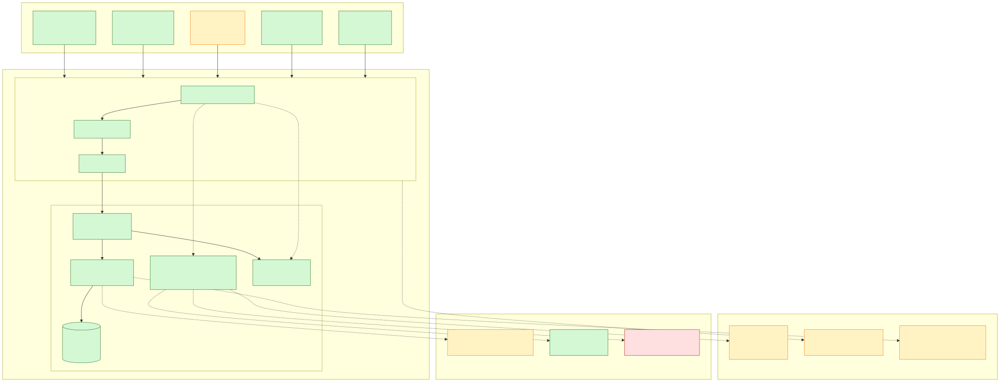

# Puntovivo Architecture

Puntovivo is a local-first modular monolith. The browser and Electron renderer
share one React application; Fastify and tRPC own business APIs; SQLite is the
operational authority. In Electron, the Fastify server runs in-process inside
main rather than as a child process.



Source diagram: [architecture.mmd](./architecture.mmd).

## Repository map

| Path              | Responsibility                                                                                                              |
| ----------------- | --------------------------------------------------------------------------------------------------------------------------- |
| `apps/web`        | React application, routes, role/module gates, user workflows, i18n, and browser tests.                                      |
| `apps/desktop`    | Electron lifecycle, sandboxed window, preload bridge, updater, local peripherals, encrypted storage, and backup operations. |
| `packages/server` | Fastify host, tRPC routers, application services, persistence, workers, fiscal, sync, payments, and tests.                  |
| `packages/shared` | Cross-workspace contracts such as roles, money, and approval types.                                                         |
| `e2e`             | Browser and Electron end-to-end journeys.                                                                                   |
| `scripts`         | CI, release, performance, setup, migration, and runtime guards.                                                             |

## Runtime shape

```text
React renderer
  -> tRPC client
    -> Fastify /api/trpc
      -> authenticated tenant/site context
        -> role and site guards
          -> application services
            -> Drizzle + SQLite transaction
              -> audit, journal, and outbox evidence
```

The browser target connects to a standalone Fastify process. The Electron
target imports `@puntovivo/server` directly into main and serves the same tRPC
surface to its renderer.

## API and application boundaries

- `/api/trpc` is the canonical application API.
- `/api/health` remains a compatibility and operational health endpoint.
- `/api/realtime/*` carries server-sent events over the canonical Bearer
  access session. Browser and local-authority renderers use streaming `fetch`;
  Store Hub clients use a fixed-endpoint main-process relay. The server
  revalidates `sessionVersion` before each heartbeat so logout, device
  revocation, and disabled users or tenants close existing streams.
- Routers validate input, authorize the actor, enforce tenant/site scope, and
  delegate non-trivial rules to application or service modules.
- Server tests call `appRouter.createCaller(...)` against in-memory SQLite;
  they do not allocate HTTP ports.
- Every operation accepting a site identifier validates that the site belongs
  to the active tenant.

## Persistence invariants

- Drizzle migrations are the only schema-change path.
- Every business query is tenant scoped. Site-owned workflows add site scope.
- Money is stored and validated under the shared rounding contract.
- Sale completion requires an active cash session for tenant, site, and
  cashier.
- Versioned mutable resources use compare-and-swap updates and report conflicts
  rather than silently overwriting concurrent edits.
- Fiscal, payment, hardware, and sync effects use dedicated durable outboxes.
- The operation journal and audit log preserve who changed sensitive state and
  which effects committed.
- Signed day-close evidence and fiscal snapshots are immutable.
- Completed sales freeze customer, site, cashier, product-name, product-SKU,
  company identity/contact, customer tax-ID, ordinary receipt template layout,
  logo source, and receipt locale. Separate version markers distinguish
  deliberately empty sale-time identity or presentation fields from
  pre-migration rows, which retain current-row compatibility fallback. A sale
  completed without an active template remains on the legacy renderer even if
  a template is configured later.

## Local storage and recovery

Packaged Electron databases use SQLCipher. The database key is obtained through
Electron secure storage and never crosses into the renderer. Node and Electron
share the target platform's bundled better-sqlite3 v13 Node-API binary. Runtime
preflights execute a SQLCipher probe under Node or Electron, and desktop
packaging prunes every non-target native binary before signing.

Backups are encrypted bundles with integrity inspection. Creation checkpoints
the WAL first. Restore uses staging, format detection, key validation, and a
server restart boundary. Scheduled snapshots, restore drills, backup-protection
status, and S3-compatible cloud-vault upload all remain main-process
capabilities.

## Product search boundary

Interactive literal search resolves indexed exact SKU/barcode lanes first,
then a tenant-scoped FTS5/BM25 shortlist, and uses a bounded `LIKE` scan only
as a compatibility fallback for text that the tokenizer cannot represent.

Semantic search is a hybrid reranker rather than a second catalog scan. It
unions exact matches with a high-recall OR-token FTS shortlist, falls back to
substring candidates only when FTS returns none, and enforces a hard ceiling
of 200 candidate ids. Only those tenant-owned rows whose stored vector uses
the active embedding model are decoded and cosine-scored in JavaScript. Thus
request memory and CPU are bounded independently of catalog size. Invoice and
voice matching retain an explicit all-tenant embedding loader because they are
separate batch workflows; interactive routes must never call that loader.

New vectors use the portable, versioned `PVEC` float32 BLOB; legacy JSON rows
remain readable until explicit catalog regeneration replaces them. This avoids
another native extension while reducing the retained 200-vector pool's storage
and decode cost. The current Ollama default is the corpus-selected 768-dimension
`embeddinggemma`; OpenAI retains `text-embedding-3-small`. Equal dimensions do
not imply compatible embedding spaces, so model changes require regeneration.
[ADR-0011](./architecture/0011-product-search-vectors.md) owns the codec,
benchmark, market comparison, and extension-adoption trigger.

## Price-tier boundary

Products expose a three-price grid for their base unit. Each alternate unit
assignment carries its own `price`, `price2`, and `price3`; an unset alternate
tier is stored as zero and resolves to that assignment's Tier 1 price rather
than to the product's base-unit price. The shared price-tier contract is used
by browser and server code so fallback behavior cannot diverge by surface.

Customer selection and price application are deliberately separate actions.
Selecting a customer validates identity and availability but never rewrites an
open cart or quotation. The operator must explicitly apply Tier 1, 2, or 3 in
Sales, POS Touch, or the quotation editor. Sale completion resolves the final
customer once under tenant scope, then reuses that canonical result for credit,
loyalty, persistence, and audit behavior.

Every completed sale item freezes the three catalog prices that were available
for its selected unit. Draft completion re-evaluates price overrides against
the final customer and that frozen grid, so changing a draft's customer cannot
erase a real override or manufacture one from later catalog edits. Quotations
store the explicitly selected tier as document metadata alongside their frozen
line prices.

## Single-tax-kind fiscal boundary

The current compatibility model assigns exactly one tax kind (`iva` or `inc`)
to each product and freezes that kind on sale, quotation, and fiscal-document
lines. A numeric line override is valid only when it matches an active,
tenant-owned rate of that same kind; an unchanged historical product rate
remains readable after a catalog rate is disabled. Demo seed catalogs are
country-specific and never rewrite an operator's existing rate catalog.

Fiscal creation recomputes the rounded IVA and INC line totals and requires
their sum to equal the frozen sale header inside the same write transaction
that creates the document, enqueues its outbox item, and advances numbering.
Receipt renderers expand the legacy `taxTotal` layout token into distinct IVA
and INC rows when frozen kind evidence exists, while old rows without that
evidence retain the generic Tax label.

The Colombia mock adapter may serialize the frozen `unitMeasureCode` as the
UBL 2.1 quantity `unitCode`. Its output is deliberately labelled a local,
unsigned, untransmitted and non-certified draft. It is not a provider,
authority response, certification artifact, or production transmission path.
Multiple tax components on one line remain outside this boundary until the
normalized component model is adopted.

## Electron security boundary

The main window uses `contextIsolation: true`, `nodeIntegration: false`, and
`sandbox: true`. Renderer code cannot read files, spawn processes, open native
sockets, or import Node modules.

Every desktop capability follows:

```text
renderer -> contextBridge wrapper -> ipcRenderer.invoke
         -> validated ipcMain.handle -> main-process capability
```

Preload wrappers stay narrow and declarative. Business data normally flows over
tRPC; IPC is reserved for desktop-only lifecycle, storage, updater, backup,
printing, and local-device capabilities.

For the single production `BrowserWindow`, the main process also retains the
currently verified access token in memory only. A renderer reload can request
that token through the narrow `session.resume` channel; main re-verifies it
against the active authority before returning it and clears the singleton when
it is expired, stale, or no longer belongs to the registered identity. The
token is never written to disk and remains absent from session diagnostics.

Database and sync IPC methods are constructed through an Electron-free handler
core that resolves the tenant from that verified main-process session before
validation or persistence can run; renderer tenant hints are compatibility
inputs only and never control scope. Workstation-settings writes and the
server-issued device-id setter use the same authorization primitive. The
pre-login locale update remains structurally separate because it must translate
the login window, tray, and updater before authentication. The read-only device
id is needed to complete login; read-only workstation presentation preferences
contain no tenant or business data. Node tests enumerate every authenticated
db/sync channel and pin those bounded pre-login exceptions. Expected stale-session
failures cross the main/preload wire as a closed error envelope instead of a
rejected `ipcMain.handle` call; preload recreates the renderer rejection without
Electron's internal invoke wrapper or a main-process stack diagnostic.

## Sync and Authority Node

The local database remains authoritative. `sync_outbox` records eventual
replication work and conflict policy without making network availability a
precondition for a local sale. Runtime modes are:

- `device_local` — one installation owns its local authority;
- `site_hub` — a LAN-accessible authority for a store;
- `hub_client` — a terminal that submits commands to the store hub and may use
  a local hardware bridge.

In Electron `hub_client` mode, authentication renewal is a main-process
capability rather than a renderer cookie flow. Main performs login, refresh,
staff switching, and logout against the configured hub; proxies renderer
`/api/*` traffic only to that fixed destination with an explicit request-header
allowlist; seals the rotating refresh and CSRF values with `safeStorage`; and persists the envelope with
owner-only file permissions (`0600` where supported and the per-user OS ACL on
Windows). The renderer receives only the short-lived access token and
response-shaped API results; it never receives the renewable cookies or a
general-purpose network primitive. Desktop IPC
registration accepts that token only when it exactly matches the grant
currently held by the main-process hub session, so it never attempts to
validate a remote-hub signature with the embedded local server secret. Packaged
clients require an HTTPS hub URL; development permits HTTP only on a loopback
address.

The sync kernel is implemented, but it is not a promise of hosted, offline
multi-master cloud replication. Public readiness and known operational gaps are
listed in [PROJECT-STATUS.md](./PROJECT-STATUS.md).

## Module and UI architecture

Routes are lazy loaded and protected by authentication, role, site, and module
state. Server and web share the role contract. TanStack Query owns server
state; Zustand or component state owns client-only interaction state. Visible
copy lives in bilingual locale namespaces and Spanish uses neutral Latin
American `tú` forms.

Vertical modules may exist without being part of the retail production wedge.
Inactive modules must not add navigation, permissions, or operational noise.

## Durable decisions

Architecture Decision Records in [architecture/](./architecture/README.md)
own decisions that future changes must preserve:

- local-store authority;
- command envelope;
- outbox taxonomy;
- conflict policy;
- sync payload contract;
- local data security;
- module activation;
- Authority Node runtime modes;
- money storage and validation;
- labor overtime evidence.

## Related references

- [TRPC_ARCHITECTURE.md](./TRPC_ARCHITECTURE.md)
- [TRPC_TESTING_GUIDE.md](./TRPC_TESTING_GUIDE.md)
- [DESKTOP_RUNTIME_GUIDE.md](./DESKTOP_RUNTIME_GUIDE.md)
- [SECURITY.md](./SECURITY.md)
- [FISCAL-INTEGRATION.md](./FISCAL-INTEGRATION.md)
- [HARDWARE-POS.md](./HARDWARE-POS.md)
- [TESTING.md](./TESTING.md)
