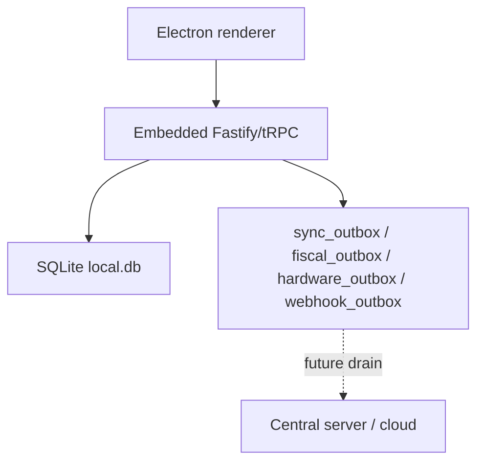
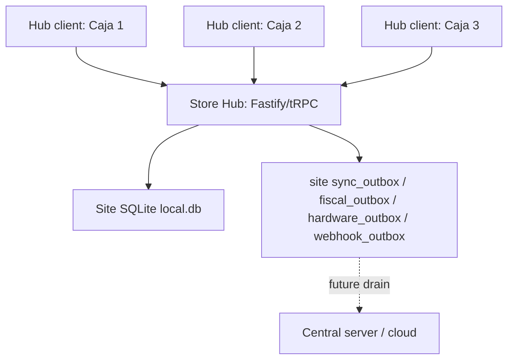
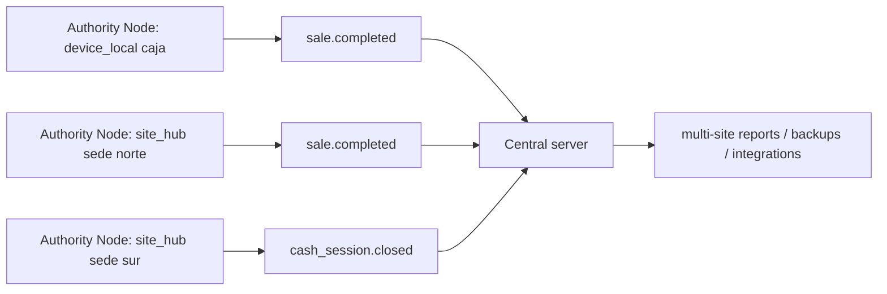

# Authority Node Runtime Modes

Puntovivo needs to support two commercial shapes without splitting the
product into two architectures:

- a small store where one cashier device is enough;
- a store with several cashier terminals that should write to one local
  site database so reports do not require visiting every register.

The common abstraction is the **Authority Node**: the runtime process
that owns operational writes for a sale, cash movement, inventory
movement, fiscal document, or outbox event.

## Modes

| Mode | Is Authority Node? | Default? | Writes operational tables? | Typical use |
| --- | --- | --- | --- | --- |
| `device_local` | Yes | Yes | Yes, to its own SQLite file | One register, demo, contingency, smallest deployment |
| `site_hub` | Yes | No | Yes, to the site SQLite file | One store with several cashier terminals |
| `hub_client` | No | No | No, sends commands to a hub | Extra cashier terminal, tablet, KDS/client surface |

`device_local` is the current product shape and remains the default.
`site_hub` is an explicit operator choice. `hub_client` is only valid
when it can reach a configured hub.

## Diagrams

### Device-local default



The cashier device is the Authority Node. The cloud is optional and
downstream.

### Store Hub Mode



The Store Hub is the Authority Node. Hub clients are terminals. They
send commands such as "complete this sale"; the hub validates,
persists, emits journal/outbox rows, and returns the accepted sale.

### Future central server



The central server should not care whether an event came from a
single-register Authority Node or a hub Authority Node. It receives the
same event contract from the local source of truth.

## What "central server" means

The central server is a future cloud or back-office service that
aggregates multiple Authority Nodes. It can support:

- multi-site reporting;
- off-box backup and restore;
- remote monitoring;
- webhook delivery and integrations;
- owner/admin dashboards outside the store LAN;
- catalog/config distribution in a later phase.

It is not in the hot path of a retail sale. A store should continue
selling if the central server or internet is unavailable.

## Rules

1. Only an Authority Node writes operational tables.
2. Only an Authority Node emits operational outbox rows for its accepted
   command.
3. A hub client must never mount or write the hub SQLite file directly.
4. `device_local` must boot with zero extra configuration.
5. `site_hub` must require explicit operator configuration before
   binding on LAN.
6. A hub client may execute physical device I/O through a client-local
   hardware bridge for peripherals attached to that terminal. The
   bridge never writes sales, cash, inventory, fiscal, journal, or
   outbox tables.
7. Hub clients fail closed in v1 when the hub is unavailable. Offline
   satellite writes are a separate spike, not part of the first hub
   support.
8. `deviceId` remains mandatory for critical commands. In hub mode it
   identifies the client terminal that requested the command; the hub is
   still the Authority Node that persists it.
9. Reports read from the Authority Node DB for local operations. Cloud
   reports read from the central server once ingestion exists.

## Runtime Config

The eventual config shape should be local to the installation, not a
tenant setting pulled from cloud. The runtime must know how to boot
before it can call any backend.

```ts
type AuthorityMode = 'device_local' | 'site_hub' | 'hub_client';

type RuntimeConfig = {
  authorityMode: AuthorityMode;
  siteId?: string;
  deviceId?: string;
  hubUrl?: string;
  bindHost?: '127.0.0.1' | '0.0.0.0' | string;
  bindPort?: number;
  allowedLanOrigins?: string[];
};
```

Initial defaults:

```ts
{
  authorityMode: 'device_local',
  bindHost: '127.0.0.1',
  bindPort: 8090
}
```

**Shipped via ENG-072 (2026-05-08)**: the resolver lives at
[`packages/server/src/config/runtime.ts`](../packages/server/src/config/runtime.ts).
Both [`packages/server/src/standalone.ts`](../packages/server/src/standalone.ts)
and [`apps/desktop/src/main/index.ts`](../apps/desktop/src/main/index.ts)
call `resolveRuntimeConfig({ env: process.env })` at boot. Env vars
documented in [`docs/ENVIRONMENT_CONFIGURATION.md`](./ENVIRONMENT_CONFIGURATION.md).
The diagnostics export bundle (ENG-065c) carries a `manifest.runtime`
object with the resolved config so a support ticket reveals the
boot identity. Behavior for `site_hub` LAN bind + `hub_client`
tRPC base URL switch lands in ENG-073 and ENG-074 respectively;
the resolver returns the values, it does not yet enforce LAN bind
nor switch the renderer transport.

## Packaging Options

The first implementation should reuse the current server package:

- `device_local`: Electron embeds `@puntovivo/server` exactly as today.
- `site_hub`: Electron or standalone Node runs `@puntovivo/server` with
  explicit LAN binding and the site SQLite file.
- `hub_client`: Electron/Web renderer points tRPC at the hub URL. If
  the terminal owns USB/HID peripherals, a client-local bridge handles
  physical device I/O after the hub authorizes the command or returns
  the printable payload.

A future `puntovivo-store-hub` open package can be a thin distribution
wrapper around the same server runtime, migrations, device pairing and
backup tooling. It should not fork the domain logic.

## Ticket Plan

### ENG-071 - Authority Node ADR + runtime config contract

Goal: lock the architecture and introduce the config contract without
changing runtime behavior.

Acceptance:

- ADR-0008 accepted and linked from the architecture index.
- `docs/AUTHORITY-NODE.md` explains `device_local`, `site_hub`,
  `hub_client`, and central-server relationship.
- ROADMAP and SPRINT plan expose the implementation sequence.
- Default remains `device_local`.

### ENG-072 - Device-local default hardening

Goal: make the current behavior explicit in code.

Acceptance:

- Shared runtime config resolver returns `device_local` when no config
  exists.
- Electron embedded server still binds loopback by default.
- Existing desktop/web tests pass without config files.
- Diagnostics export includes authority mode and server URL.

### ENG-073 - Store Hub server mode

Goal: let one machine run as a site hub over LAN.

Acceptance:

- Explicit `site_hub` config can bind Fastify to `0.0.0.0` or a chosen
  LAN IP.
- CORS and CSRF settings accept configured LAN origins only.
- Startup refuses LAN binding without production-grade JWT secret and
  explicit allowed origins.
- Hub health endpoint reports authority mode, site, app version, DB
  path fingerprint, and active devices count.
- SQLite remains owned by one server process.

### ENG-074 - Hub Client mode

Goal: let a cashier terminal connect to a configured Store Hub.

Acceptance:

- `hub_client` config points tRPC at `hubUrl`.
- Device registration records the terminal as a hub client.
- Login, site selection, cash session open, sale completion, and
  barcode scan run against the hub.
- Peripherals physically attached to the hub-client terminal execute
  through a client-local hardware bridge. The hub remains the
  Authority Node for the accepted operation, journal and outbox state.
- UI shows hub reachability before sale checkout.
- If the hub is unavailable, sale completion is blocked with a clear
  recovery message.

### ENG-075 - Device pairing and authority health

Goal: make hub deployments operable by non-engineers.

Acceptance:

- Store Hub exposes a short-lived pairing code for new terminals.
- Device registry tracks role, last seen, app version, DB schema
  version, health status and paired site.
- Operations Center has an Authority tab showing hub status and client
  terminals.
- Admin can revoke a hub client.

### ENG-076 - Satellite offline fallback spike

Goal: decide whether hub clients should ever write locally when the hub
is down.

Recommendation: defer until real pilots prove that fail-closed hub
clients are not enough. This is a separate architecture problem because
it introduces terminal-to-hub sync, conflict handling, and duplicate
prevention.

Acceptance:

- Decision document compares fail-closed, local draft-only, and full
  offline satellite writes.
- No implementation until a pilot requirement justifies the extra sync
  plane.
