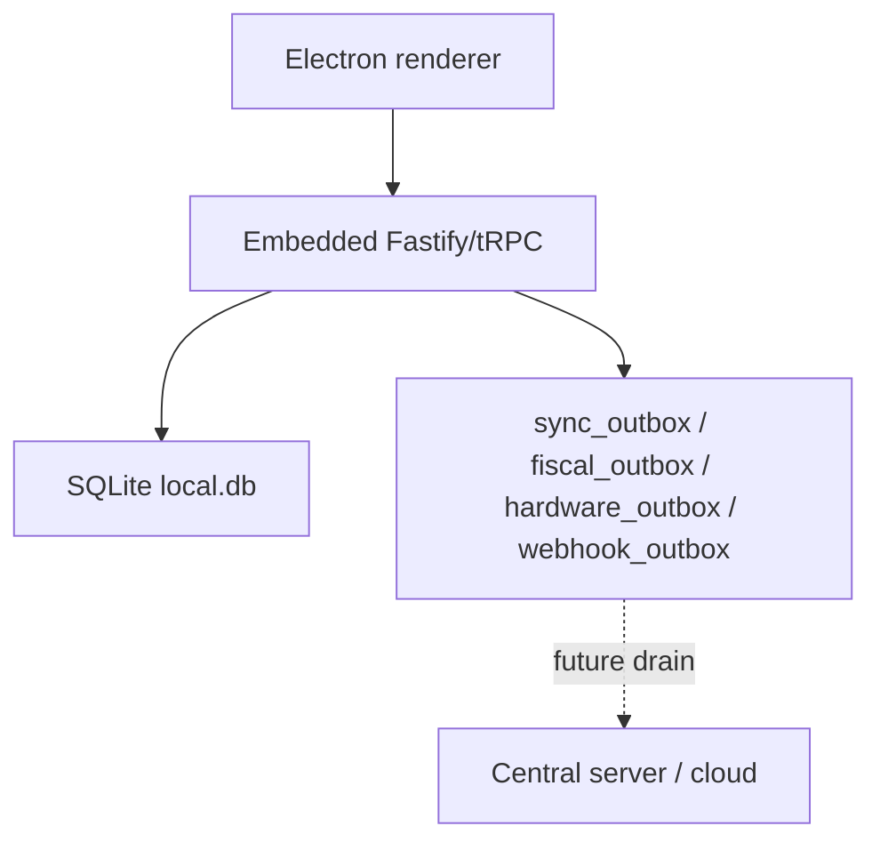
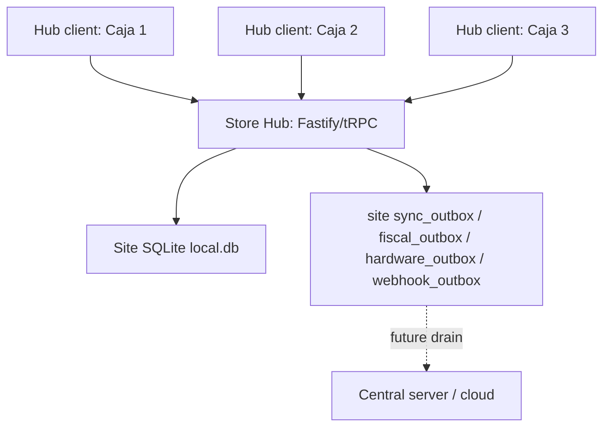
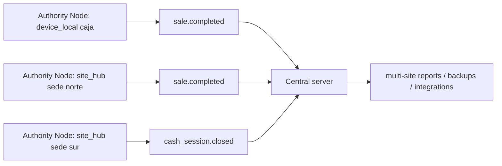

# Authority Node Runtime Modes

Puntovivo needs to support two commercial shapes without splitting the
product into two architectures:

- a small store where one cashier device is enough;
- a store with several cashier terminals that should write to one local
  site database so reports do not require visiting every register.

The common abstraction is the **Authority Node**: the runtime process
that owns operational writes for a sale, cash movement, inventory
movement, fiscal document, or outbox event.

## Modes

| Mode | Is Authority Node? | Default? | Writes operational tables? | Typical use |
| --- | --- | --- | --- | --- |
| `device_local` | Yes | Yes | Yes, to its own SQLite file | One register, demo, contingency, smallest deployment |
| `site_hub` | Yes | No | Yes, to the site SQLite file | One store with several cashier terminals |
| `hub_client` | No | No | No, sends commands to a hub | Extra cashier terminal, tablet, KDS/client surface |

`device_local` is the current product shape and remains the default.
`site_hub` is an explicit operator choice. `hub_client` is only valid
when it can reach a configured hub.

## Diagrams

### Device-local default



The cashier device is the Authority Node. The cloud is optional and
downstream.

### Store Hub Mode



The Store Hub is the Authority Node. Hub clients are terminals. They
send commands such as "complete this sale"; the hub validates,
persists, emits journal/outbox rows, and returns the accepted sale.

### Future central server



The central server should not care whether an event came from a
single-register Authority Node or a hub Authority Node. It receives the
same event contract from the local source of truth.

## What "central server" means

The central server is a future cloud or back-office service that
aggregates multiple Authority Nodes. It can support:

- multi-site reporting;
- off-box backup and restore;
- remote monitoring;
- webhook delivery and integrations;
- owner/admin dashboards outside the store LAN;
- catalog/config distribution in a later phase.

It is not in the hot path of a retail sale. A store should continue
selling if the central server or internet is unavailable.

## Rules

1. Only an Authority Node writes operational tables.
2. Only an Authority Node emits operational outbox rows for its accepted
   command.
3. A hub client must never mount or write the hub SQLite file directly.
4. `device_local` must boot with zero extra configuration.
5. `site_hub` must require explicit operator configuration before
   binding on LAN.
6. A hub client may execute physical device I/O through a client-local
   hardware bridge for peripherals attached to that terminal. The
   bridge never writes sales, cash, inventory, fiscal, journal, or
   outbox tables.
7. Hub clients fail closed in v1 when the hub is unavailable. Offline
   satellite writes are a separate spike, not part of the first hub
   support.
8. `deviceId` remains mandatory for critical commands. In hub mode it
   identifies the client terminal that requested the command; the hub is
   still the Authority Node that persists it.
9. Reports read from the Authority Node DB for local operations. Cloud
   reports read from the central server once ingestion exists.

## Runtime Config

The eventual config shape should be local to the installation, not a
tenant setting pulled from cloud. The runtime must know how to boot
before it can call any backend.

```ts
type AuthorityMode = 'device_local' | 'site_hub' | 'hub_client';

type RuntimeConfig = {
  authorityMode: AuthorityMode;
  siteId?: string;
  deviceId?: string;
  hubUrl?: string;
  bindHost?: '127.0.0.1' | '0.0.0.0' | string;
  bindPort?: number;
  allowedLanOrigins?: string[];
};
```

Initial defaults:

```ts
{
  authorityMode: 'device_local',
  bindHost: '127.0.0.1',
  bindPort: 8090
}
```

**Shipped via ENG-072 (2026-05-08)**: the resolver lives at
[`packages/server/src/config/runtime.ts`](../packages/server/src/config/runtime.ts).
Both [`packages/server/src/standalone.ts`](../packages/server/src/standalone.ts)
and [`apps/desktop/src/main/index.ts`](../apps/desktop/src/main/index.ts)
call `resolveRuntimeConfig({ env: process.env })` at boot. Env vars
documented in [`docs/ENVIRONMENT_CONFIGURATION.md`](./ENVIRONMENT_CONFIGURATION.md).
The diagnostics export bundle (ENG-065c) carries a `manifest.runtime`
object with the resolved config so a support ticket reveals the
boot identity. Behavior for `site_hub` LAN bind + `hub_client`
tRPC base URL switch lands in ENG-073 and ENG-074 respectively;
the resolver returns the values, it does not yet enforce LAN bind
nor switch the renderer transport.

## Store Hub Mode (operator setup, ENG-073)

When the operator opts a machine into Store Hub mode the embedded
Fastify becomes reachable to every cashier terminal on the LAN.
That widens the trust surface beyond the loopback default, so the
boot path now refuses to come up unless two operator-controlled
guarantees are in place.

### Required environment

```bash
# Authority Node mode + bind surface
PUNTOVIVO_AUTHORITY_MODE=site_hub
PUNTOVIVO_BIND_HOST=0.0.0.0           # or a specific LAN IP
PUNTOVIVO_BIND_PORT=8090

# Hardening — both required, both checked at boot
JWT_SECRET=<32+ char random secret, persisted across restarts>
PUNTOVIVO_ALLOWED_LAN_ORIGINS=http://192.168.1.10:3000,http://192.168.1.11:3000
```

The boot refusal contract:

| Missing piece | Boot result |
| --- | --- |
| `JWT_SECRET` (missing, shorter than 32 chars, too little character variety, or placeholder) | Throws with the failed strength rule + a pointer back to this section. |
| `PUNTOVIVO_ALLOWED_LAN_ORIGINS` (no operator-defined CORS surface) | Same. |
| Both | Single error names both pieces. |
| Both supplied | Server boots and accepts only the listed LAN origins. |

The strength check is deliberately simple and operator-readable:
trimmed length at least 32 characters, at least 8 unique
characters, and not a common placeholder such as `secret`,
`change-me`, `password`, or a numeric sequence. A generated
32-byte hex or base64 value is the intended production shape.

`device_local` and `hub_client` modes skip this check — the former
is loopback-only, the latter only consumes a remote hub.

### CORS / CSRF

Origins are exact-match strings. Wildcards (`http://192.168.*`)
are intentionally rejected: the configured allow-list is the audit
surface. CSRF stays cookie+header so the existing same-origin
protection keeps working with `credentials: true` cross-origin.

### Out of scope

- **TLS termination**: the embedded Fastify binds plain HTTP. Run
  a reverse proxy (nginx, Caddy, or the operator's existing
  edge) on the hub box if you want HTTPS over the LAN.
- **Cross-LAN access**: the bind list trusts the LAN broadcast
  domain. Multi-VLAN reachability is a network-engineering
  concern, not an Authority Node concern.
- **Per-tenant active-device count on `/api/health`**: ENG-073
  surfaces a hub-wide aggregate. ENG-075 ships the tenant-scoped
  count inside the authenticated Operations Center Authority tab.

### Known gap — cross-origin refresh cookies (deferred after ENG-074)

The CSRF cookie set by `packages/server/src/security/csrf.ts` uses
`SameSite=Lax`; the refresh cookie is stricter after ENG-166
(`SameSite=Strict`). Browsers do not send either cookie on cross-origin
sub-resource requests, so a
cashier terminal at `http://192.168.1.50:3000` POSTing to
`http://192.168.1.1:8090/api/trpc/...` will not transmit the
session cookies even with `credentials: 'include'`. ENG-073 ships the
hub bind hardening + LAN CORS surface, ENG-074 ships the renderer tRPC
base URL switch + reachability UI, and ENG-166 tightens the default
cookie posture, but none of those tickets adds the HTTPS or Bearer-only
refresh design needed for cross-origin hub refresh.

Operationally this means: a hub-client cashier can work against the
hub with the Bearer access token issued at login, but the
cross-origin refresh cookie remains unavailable. Cashiers re-login
when that access token expires. A future iter must
choose either `SameSite=None; Secure` (which requires HTTPS on the
hub origin) or a Bearer-only refresh path.

### Health surface

`GET /api/health` (unauthenticated, Kubernetes-style) returns:

```json
{
  "status": "ok",
  "timestamp": "...",
  "compatibility": true,
  "canonicalProcedure": "health.check",
  "canonicalPath": "/api/trpc/health.check",
  "authorityMode": "device_local | site_hub | hub_client",
  "appVersion": "1.x.y",
  "dbSchemaVersion": <applied migration count from __drizzle_migrations>,
  "dbPathFingerprint": "<12-char SHA-256 of dbPath, never the raw path>",
  "activeDeviceCount": <devices.is_active=1 across tenants>
}
```

None of the new fields carry secrets. Operators can `curl
http://hub:8090/api/health` from any machine on the configured
LAN to verify which mode the hub is running, what schema
version is deployed, and how many devices are currently
registered.

## Hub Client Mode (operator setup, ENG-074)

A `hub_client` terminal is a cashier device whose renderer points
at a remote Store Hub instead of an embedded backend. It is NOT an
Authority Node — it only originates commands; the hub persists and
emits all operational outbox rows.

### Required environment

```bash
# Authority Node mode + hub URL
PUNTOVIVO_AUTHORITY_MODE=hub_client
PUNTOVIVO_HUB_URL=http://192.168.1.1:8090

# Optional identifiers (otherwise device-id.txt is the source)
PUNTOVIVO_DEVICE_ID=caja-2
PUNTOVIVO_SITE_ID=sede-norte
```

The Electron main process reads these via `resolveRuntimeConfig`,
caches the result, and exposes it to the renderer through a
synchronous IPC channel (`runtime:get-config`). The renderer's
`apps/web/src/lib/runtimeConfigClient.ts` resolves the config at
module init so `apps/web/src/lib/trpc.ts` can pick the right base
URL before the tRPC client is constructed.

### Reachability + checkout gate

The renderer's `useHubReachability` hook polls `${hubUrl}/api/health`
every 30 seconds with a 5-second abort timeout. When the hub
returns a non-2xx response (or the request errors out), the
`GlobalStatusStrip` switches to the "Store hub unreachable" variant
and the checkout entry points (`SalesCheckoutPanel` and
`SalesMobileCheckoutBar`) disable their primary action button.
The hook is a no-op outside `hub_client` mode so
device_local installs see zero overhead.

The poll cadence and the abort timeout are constants today; the
ENG-074b follow-up may surface env-var overrides if a pilot
demands tuning.

### Device registration

After login, `AuthProvider` calls `auth.registerDevice` with
`kind: 'hub_client'` so the hub's `devices` table records the
terminal as a hub client. The `kind` enum extends from
`['desktop', 'web']` to `['desktop', 'web', 'hub_client']` — no
schema migration is required because the column is plain text and
the constraint is TS-only.

**ENG-075 shipped 2026-05-11**: `auth.registerDevice` also records
the resolved `authorityMode`, paired `siteId` (when present), app
version and DB schema version. The `devices` table now has explicit
Authority topology columns (`authority_role`, `paired_site_id`,
`app_version`, `db_schema_version`) so the Operations Center can
separate full local installs, the Store Hub Authority Node and
hub-client terminals without guessing from `kind` alone.

### Known gaps and follow-ups

**Cookie SameSite refresh (deferred)**: the CSRF cookie uses
`SameSite=Lax` and the refresh cookie uses `SameSite=Strict`, so
cross-origin LAN requests from a `hub_client` terminal cannot transmit
them. The practical effect is that the access token is the de-facto
session length: hub-client cashiers re-login when the token expires.
This was documented as a "Known gap" in the ENG-073 ship and the same
constraint applies here. Fixing requires either flipping the cookie
attributes to `SameSite=None; Secure` (which forces HTTPS on the hub box)
or moving to a Bearer-only refresh path. Captured for a future iter.

**Client-local hardware bridge (`ENG-074b`) — Shipped 2026-05-09**.
A `hub_client` terminal with a USB / TCP / serial printer attached
now dispatches receipts and drawer kicks locally. Two new read-only
hub procedures (`peripherals.buildReceiptBytes`,
`peripherals.buildDrawerKickBytes`) return the ESC/POS bytes plus
a `transportHint` mirrored from the hub-side
`site_peripherals.config_json`. The renderer in `hub_client` mode
pipes those bytes through `window.electron.peripherals.dispatchLocalEscpos`
(new IPC channel `peripherals:dispatch-local-escpos`) which the
Electron main module `apps/desktop/src/main/peripherals/local-bridge.ts`
hands to `resolveTransport` from `@puntovivo/server` and writes
synchronously. The dispatcher returns `{success, error?, errorCode?}`
so the renderer surfaces the existing `onEscposFallback` toast on
failure (USB unplug, TCP refused, USB/serial driver stub
`DRIVER_NOT_IMPLEMENTED`). The hard guarantee from ADR-0008 rule 6
— "the bridge never writes sales, cash, inventory, fiscal, journal,
or outbox tables" — is preserved by construction: the bridge module
has zero database imports (an architectural lint test pins this by
substring-scanning the source) and the new server procedures are
`.query`-typed reads that count as zero `hardware_outbox` writes
across calls (asserted by the `peripherals-build-bytes.test.ts`
invariant pin). USB and serial transports remain stubs
(`DRIVER_NOT_IMPLEMENTED`) until a hardware lab session activates
them; the bridge fails gracefully, the legacy HTML print path runs.
The renderer fork lives in `apps/web/src/features/sales/receiptPrinter.ts`
(`createEscposReceiptDispatcher` + `dispatchDrawerKick`) so
`SaleDetailsModal` and `SalesPage` consume one routing decision
regardless of authority mode.

## Pairing and Authority Health (ENG-075)

Hub deployments are now operable from the Operations Center:

- Admins create short-lived pairing codes from
  `/operations?tab=authority`. The code is shown once to the
  operator, stored only as a SHA-256 hash scoped to the tenant, and
  expires after the configured TTL (default 10 minutes, max 60).
- Hub clients claim a code during `auth.registerDevice` by sending
  `pairingCode`. The claim path validates tenant + site scope, requires
  `kind: 'hub_client'`, and updates the pairing row with
  `status='claimed'` using a `status='pending'` guard so the code cannot
  be reassigned after the first successful claim.
- The Authority tab shows runtime mode, DB schema version, active
  device count, pending pairing-code count, per-device role, paired
  site, last seen, app version and derived health status
  (`online`, `stale`, `revoked`).
- Admins can revoke hub-client terminals from the same tab. The server
  deactivates the device and writes an audit row with
  `action='device.revoke'` and `resourceType='device'`.
- Diagnostics preview/export include the same `authorityTopology`
  projection so a support bundle contains the Store Hub topology
  without querying the UI separately.

The Authority tab is read-only for managers except status inspection.
Pairing-code creation and hub-client revocation remain admin-only.

## Packaging Options

The first implementation should reuse the current server package:

- `device_local`: Electron embeds `@puntovivo/server` exactly as today.
- `site_hub`: Electron or standalone Node runs `@puntovivo/server` with
  explicit LAN binding and the site SQLite file.
- `hub_client`: Electron/Web renderer points tRPC at the hub URL. If
  the terminal owns USB/HID peripherals, a client-local bridge handles
  physical device I/O after the hub authorizes the command or returns
  the printable payload.

A future `puntovivo-store-hub` open package can be a thin distribution
wrapper around the same server runtime, migrations, device pairing and
backup tooling. It should not fork the domain logic.

## Ticket Plan

### ENG-071 - Authority Node ADR + runtime config contract

Goal: lock the architecture and introduce the config contract without
changing runtime behavior.

Acceptance:

- ADR-0008 accepted and linked from the architecture index.
- `docs/AUTHORITY-NODE.md` explains `device_local`, `site_hub`,
  `hub_client`, and central-server relationship.
- ROADMAP and SPRINT plan expose the implementation sequence.
- Default remains `device_local`.

### ENG-072 - Device-local default hardening

Goal: make the current behavior explicit in code.

Acceptance:

- Shared runtime config resolver returns `device_local` when no config
  exists.
- Electron embedded server still binds loopback by default.
- Existing desktop/web tests pass without config files.
- Diagnostics export includes authority mode and server URL.

### ENG-073 - Store Hub server mode

Goal: let one machine run as a site hub over LAN.

Acceptance:

- Explicit `site_hub` config can bind Fastify to `0.0.0.0` or a chosen
  LAN IP.
- CORS and CSRF settings accept configured LAN origins only.
- Startup refuses LAN binding without production-grade JWT secret and
  explicit allowed origins.
- Hub health endpoint reports authority mode, site, app version, DB
  path fingerprint, and active devices count.
- SQLite remains owned by one server process.

### ENG-074 - Hub Client mode

Goal: let a cashier terminal connect to a configured Store Hub.

Acceptance:

- `hub_client` config points tRPC at `hubUrl`.
- Device registration records the terminal as a hub client.
- Login, site selection, cash session open, sale completion, and
  barcode scan run against the hub.
- Peripherals physically attached to the hub-client terminal execute
  through a client-local hardware bridge. The hub remains the
  Authority Node for the accepted operation, journal and outbox state.
- UI shows hub reachability before sale checkout.
- If the hub is unavailable, sale completion is blocked with a clear
  recovery message.

### ENG-075 - Device pairing and authority health

Goal: make hub deployments operable by non-engineers.

Acceptance:

- Store Hub exposes a short-lived pairing code for new terminals.
- Device registry tracks role, last seen, app version, DB schema
  version, health status and paired site.
- Operations Center has an Authority tab showing hub status and client
  terminals.
- Admin can revoke a hub client.

Shipped 2026-05-11 with migration `0021_authority_device_pairing.sql`,
the `authority` tRPC router, diagnostics `authorityTopology`, localized
Operations Center UI, audit action `device.revoke`, and live
`/operations?tab=authority` smoke coverage.

### ENG-076 - Satellite offline fallback spike

Goal: decide whether hub clients should ever write locally when the hub
is down.

Recommendation: defer until real pilots prove that fail-closed hub
clients are not enough. This is a separate architecture problem because
it introduces terminal-to-hub sync, conflict handling, and duplicate
prevention.

Acceptance:

- Decision document compares fail-closed, local draft-only, and full
  offline satellite writes.
- No implementation until a pilot requirement justifies the extra sync
  plane.
