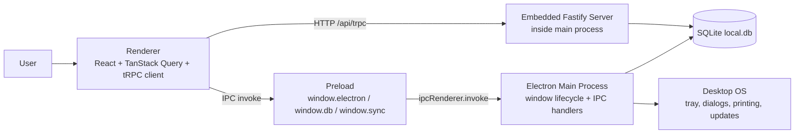
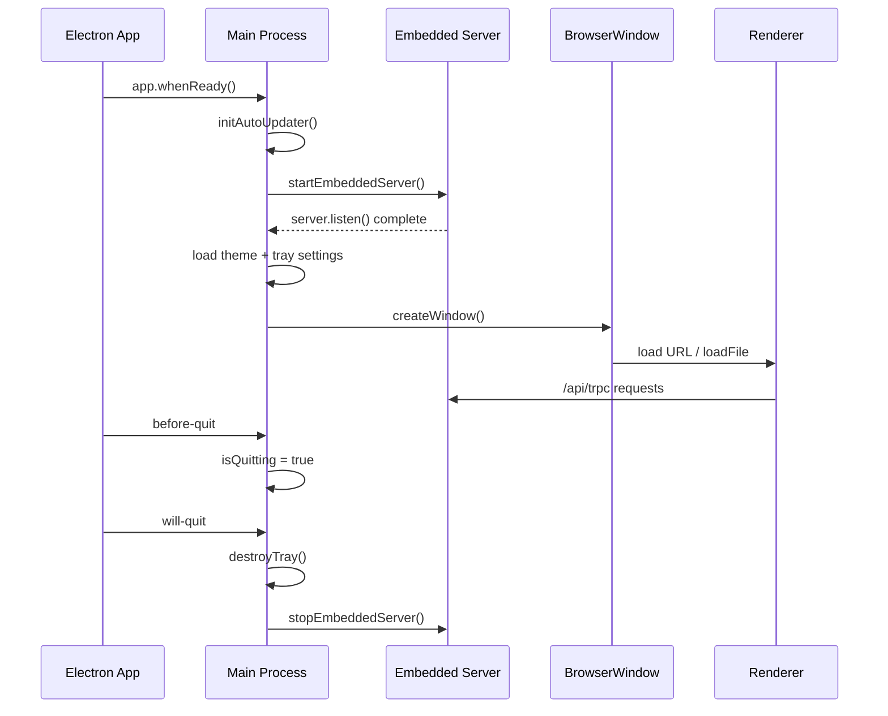
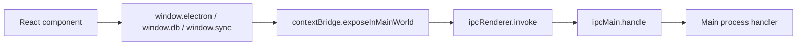

# Desktop Runtime Guide

> Updated: April 11, 2026
> Audience: developers who need to understand Electron runtime behavior in Puntovivo

## Why This Document Exists

The repo already had partial information spread across:

- `docs/ARCHITECTURE.md`
- `docs/DEBUGGING.md`
- `apps/desktop/src/main/index.ts`
- `apps/desktop/src/preload/index.ts`

What was missing was one document that explained, in one place:

1. the desktop application lifecycle
2. how IPC is structured and why it is exposed the way it is
3. what "watch-state" means in this repo and how it is actually used

This guide fills that gap.

## The Short Version

Puntovivo desktop is an Electron application with this shape:

- Electron main process is the host and orchestrator
- Fastify server is embedded inside the Electron main process
- React runs in the renderer
- renderer never talks directly to Node or SQLite
- preload exposes a narrow IPC bridge to the renderer
- most application data still flows through HTTP/tRPC to the embedded server
- direct IPC is used mainly for desktop-only capabilities

That means the desktop runtime is not "frontend + separate local backend process".
It is "Electron main process hosting both the backend and the desktop OS integrations".

## High-Level Diagram



## 1. Project Lifecycle

### What "lifecycle" means here

In this project, lifecycle refers to the runtime sequence of the Electron desktop app:

1. Electron starts
2. main process boots
3. embedded Fastify server starts
4. desktop preferences are loaded from SQLite
5. main browser window is created
6. renderer loads either Vite dev server or packaged `dist/index.html`
7. tray / theme / update / print / backup capabilities remain available through main
8. on quit, main tears down tray and shuts down the embedded server

### Actual boot flow in the project

The main entry is:
[index.ts](apps/desktop/src/main/index.ts)

The key lifecycle path is:

1. `app.whenReady()` waits until Electron is ready.
2. `initAutoUpdater()` initializes desktop update state.
3. `startEmbeddedServer()` starts Fastify on `127.0.0.1:8090`.
4. theme and tray settings are loaded from `app_settings`.
5. `createWindow()` creates the main `BrowserWindow`.
6. `refreshTray()` creates or updates the tray if enabled.
7. `app.on('activate')` restores or recreates the main window on macOS behavior.
8. `app.on('before-quit')` marks the app as intentionally quitting.
9. `app.on('will-quit')` destroys tray resources and stops the embedded server.

Relevant source:

- [index.ts](apps/desktop/src/main/index.ts)

### Lifecycle sequence diagram



### Why the backend is embedded in main

This is one of the most important architecture choices in the repo.

The project explicitly does not spawn a separate server process in desktop mode.
Instead, Electron main imports `@puntovivo/server` directly and starts Fastify in-process.

Why this is used:

- simpler packaging: one desktop runtime owns app window, local DB, and local HTTP server
- fewer deployment moving parts: no extra child-process supervision
- lower local orchestration complexity: backup/restore can stop and restart the embedded server directly
- easier access to shared local resources like `local.db`, tray settings, print settings, and sync metadata

Technical tradeoff:

- main process becomes operationally important because it owns window lifecycle and backend lifecycle
- if main crashes, both desktop shell and local server go down together
- desktop-only responsibilities must be kept disciplined so main does not become a giant uncontrolled service layer

### What is used in the lifecycle today

Used:

- `app.whenReady()`
- `app.on('activate')`
- `app.on('before-quit')`
- `app.on('window-all-closed')`
- `app.on('will-quit')`
- `BrowserWindow`
- `Tray`
- embedded Fastify start/stop/restart helpers

Not used as the primary model:

- spawned backend child process
- renderer-side direct Node access
- renderer-side direct SQLite access

### How close-to-tray changes lifecycle behavior

The window close flow is intentionally not always the same as app quit.

If tray is enabled and `closeToTray` is enabled:

- clicking the close button does not end the process
- `mainWindow.on('close')` prevents default
- the window is hidden instead
- tray keeps the app alive

If `closeToTray` is disabled:

- close behaves like a normal quit flow

Why this is used:

- POS-style desktop software often needs to stay available for quick reopen
- it avoids repeated cold-starts during workstation use

### Why backup/restore uses a server restart

Backup and restore do not try to copy the SQLite file while the server is actively using it.

The project uses:

- `runWithServerRestart(...)`
- `stopEmbeddedServer()`
- file operation
- `startEmbeddedServer()`
- optional renderer reload

Why this is used:

- SQLite file replacement is safer when the embedded server is not holding it open
- it avoids DB corruption risks and stale file handles
- it ensures the server reconnects to the restored file cleanly

This is a good example of why embedded lifecycle ownership in main is useful.

## 2. IPC

### What IPC means here

IPC in Electron is the communication channel between:

- renderer process
- preload bridge
- main process

In Puntovivo, IPC is used only for desktop-native or desktop-private capabilities.

The business API is still primarily tRPC over HTTP.

That distinction matters:

- business logic: usually `/api/trpc`
- desktop capabilities: usually `ipcRenderer.invoke(...)`

### The IPC layering in this repo

```text
Renderer code
  -> window.electron / window.db / window.sync
  -> preload bridge
  -> ipcRenderer.invoke(channel, payload)
  -> ipcMain.handle(channel, handler)
  -> Electron main code
```

Relevant files:

- [index.ts](apps/desktop/src/preload/index.ts)
- [index.d.ts](apps/desktop/src/preload/index.d.ts)
- [index.ts](apps/desktop/src/main/index.ts)

### Why preload exists

The renderer runs with:

- `contextIsolation: true`
- `nodeIntegration: false`

So the renderer cannot and should not call Node/Electron APIs directly.

Preload exists to expose a controlled surface into `window`.

This project exposes:

- `window.electron`
- `window.db`
- `window.sync`
- `window.api` as an aggregate compatibility surface

Why this is used:

- keeps Node/Electron power out of arbitrary renderer code
- makes the allowed desktop API explicit
- improves security compared with enabling Node integration in the renderer
- allows TypeScript typing of the desktop bridge

### IPC diagram



### What IPC channels are used

The repo currently uses `ipcMain.handle(...)` / `ipcRenderer.invoke(...)` request-response channels.

Examples:

Desktop shell / workstation:

- `get-app-version`
- `get-app-path`
- `get-server-url`
- `get-auto-update-status`
- `check-for-app-updates`
- `restart-to-apply-app-update`
- `get-tray-settings`
- `update-tray-settings`
- `get-theme-preference`
- `update-theme-preference`
- `get-receipt-print-settings`
- `update-receipt-print-settings`
- `create-database-backup`
- `restore-database-backup`
- `print-receipt`

Local DB bridge:

- `db:getAll`
- `db:getById`
- `db:insert`
- `db:update`
- `db:delete`
- `db:getByField`
- `db:deleteByTenant`
- `db:countByTenant`
- `db:addToSyncQueue`
- `db:getPendingSyncItems`

Desktop sync bridge:

- `sync:getStatus`
- `sync:triggerSync`
- `sync:setConfig`

### Why this project uses invoke/handle instead of event-style IPC

The repo mostly uses request-response IPC because it matches how the UI consumes desktop capabilities:

- ask for tray settings
- save theme preference
- create backup
- trigger sync
- print receipt

These are all command or query operations with a natural return value.

Why this is technically preferable here:

- easier to type
- easier to reason about than free-form event buses
- easier to test because each channel maps to one function
- simpler error propagation because the promise rejects or resolves

What is not used heavily:

- long-lived streaming IPC channels
- renderer-to-main event bus for business state synchronization
- general-purpose pub/sub desktop state store

### Why most business data does not go through IPC

The project intentionally keeps business CRUD on tRPC instead of moving everything to IPC.

Why:

- same application API can run in desktop, web dev, and standalone server modes
- business rules stay in `packages/server`
- avoids duplicating backend logic into Electron main handlers
- keeps renderer code consistent across browser and desktop runtimes

This is one of the cleanest architecture decisions in the repo.

### What the local DB bridge is for

The `window.db` bridge is not the canonical business API.
It is a narrow desktop/offline helper around allowlisted tables.

You can see this in main:

- allowlisted table names
- table-column normalization
- camelCase/snake_case mapping
- JSON column handling
- tenant-aware filtering for allowed reads/writes

Why it exists:

- support desktop-local/offline workflows
- support sync queue inspection and manipulation
- expose only a controlled subset of the local database

Why it is intentionally constrained:

- direct DB access from renderer is dangerous if unconstrained
- unrestricted renderer SQL would break isolation and increase security risk
- the project wants most business logic to remain server-owned

### How to extend IPC safely

Preferred process:

1. decide whether the feature is truly desktop-only
2. if it is business logic, prefer adding it to tRPC instead
3. if it is OS/runtime integration, add a preload method and a matching main handler
4. validate inputs in main, not only in renderer
5. return structured results, not ad hoc string payloads
6. keep channel names narrow and purpose-specific

Recommended pattern:

1. add method to `ElectronAPI`, `DatabaseAPI`, or `SyncAPI` in [index.ts](apps/desktop/src/preload/index.ts)
2. mirror the typing in [index.d.ts](apps/desktop/src/preload/index.d.ts)
3. expose it with `ipcRenderer.invoke(...)` in preload
4. implement `ipcMain.handle(...)` in main
5. keep the actual logic in a helper function instead of inlining large handlers

Good use cases for new IPC:

- workstation hardware integration
- OS-level dialogs
- printer or receipt-device management
- packaged-app update behavior
- desktop-only file system operations

Bad use cases for new IPC:

- normal CRUD that already belongs in the tRPC backend
- duplicating a router procedure inside Electron main
- bypassing auth/tenant rules just because desktop is local

## 3. Watch-State

### Important clarification

There is no single subsystem called "watch-state" in the repo.

In practice, this phrase maps to three different patterns:

1. React local state watched by the component render cycle
2. TanStack Query watching server state
3. `form.watch(...)` from React Hook Form watching form field changes

If you were looking specifically for a desktop runtime watcher, that is not a major architectural primitive in this project today.

### The main "watch-state" pattern actually used in the repo

The most explicit "watch" API in the codebase is React Hook Form's `form.watch(...)`.

Examples:

- [ProductFormModal.tsx](apps/web/src/features/products/ProductFormModal.tsx)
- [InventoryEntryModal.tsx](apps/web/src/features/inventory/InventoryEntryModal.tsx)
- [InventoryAdjustmentModal.tsx](apps/web/src/features/inventory/InventoryAdjustmentModal.tsx)
- [SalePaymentModal.tsx](apps/web/src/features/sales/SalePaymentModal.tsx)
- [SiteLocationAssignmentsModal.tsx](apps/web/src/features/sites/SiteLocationAssignmentsModal.tsx)
- [ProviderCategoryAssignmentsModal.tsx](apps/web/src/features/providers/ProviderCategoryAssignmentsModal.tsx)

### What `form.watch(...)` is doing

`form.watch(...)` is used when one field needs to react to another field's current value during render.

Typical examples:

- payment method changes how payment UI behaves
- quantity changes a calculated preview
- mode changes what inventory form fields are shown
- selected IDs change checkbox/list selection behavior

Why this is used:

- avoids copying form data into extra component state
- keeps the form as the source of truth
- makes conditional UI render directly from current form values

This is consistent with the repo's general style:

- avoid duplicated derived state
- avoid `useEffect` just to mirror form state
- compute derived UI from the current source of truth

### Watch-state diagram in the renderer

```mermaid
flowchart LR
    Input[Form Input]
    RHF[React Hook Form state]
    Watch[form.watch(...)]
    UI[Conditional UI / derived preview]

    Input --> RHF
    RHF --> Watch
    Watch --> UI
```

### How watch-state relates to TanStack Query

For server data, the repo does not usually "watch" data manually.
It relies on TanStack Query subscriptions through hooks like:

- `useQuery`
- `useMutation`
- invalidation after mutations

So the renderer has two clear state ownership patterns:

- form-local transient state: React Hook Form + `watch`
- server state: TanStack Query + tRPC

This separation is technically useful because it avoids mixing:

- mutable form editing concerns
- cached server truth

### How to extend watch-state safely

Preferred rules:

1. if the value comes from the server, keep TanStack Query as the source of truth
2. if the value is form-local, prefer `form.watch(...)` over copied mirror state
3. if the value is cheap to derive, compute it during render
4. avoid `useEffect` whose only job is to synchronize one state value into another

Good pattern:

- watch payment method
- show/hide transfer reference input

Bad pattern:

- `watch(field)` and then copy it into `useState`
- or `useEffect(() => setX(watchedField), [watchedField])`

Why the bad pattern is discouraged:

- extra render cycle
- stale synchronization bugs
- duplicated source of truth

## How These Three Concepts Fit Together

The easiest way to think about the desktop architecture is:

- lifecycle decides when the desktop runtime starts, hides, restores, quits, and restarts the embedded server
- IPC is the controlled bridge from renderer to desktop-only capabilities
- watch-state is mostly a renderer concern for local UI/form reactivity, not the main desktop runtime mechanism

Another way to say it:

- lifecycle = process orchestration
- IPC = process communication
- watch-state = UI reactivity

## Practical Extension Guide

### If you need to add a new desktop feature

Ask these questions in order:

1. Is it business logic or OS integration?
2. Does it need to work in browser mode too?
3. Does it need SQLite file access or other Node/Electron APIs?
4. Is the state local form state, server state, or desktop runtime state?

Use this decision table:

| Problem | Preferred extension point |
| --- | --- |
| CRUD or business rules | tRPC router in `packages/server` |
| OS dialog / tray / print / backup / updater | Electron IPC via preload + main |
| Local form reactivity | React Hook Form `watch(...)` |
| Cached server UI state | TanStack Query |
| DB file replacement or server restart | Electron main lifecycle helper |

### Example: adding a new workstation setting

Use this path:

1. add persistence logic in main using `appSettings`
2. add `ipcMain.handle(...)`
3. expose method in preload
4. type it in `index.d.ts`
5. consume it from a renderer settings card

### Example: adding a new business operation

Use this path:

1. add a tRPC procedure in `packages/server`
2. call it from the renderer with the tRPC client
3. invalidate relevant queries
4. do not add IPC unless the feature also needs Electron/OS access

## Key Technical Reasons Behind the Current Design

### Why main owns lifecycle

- Electron process lifecycle only exists there
- BrowserWindow, tray, updater, print, and dialogs are main-process concerns
- embedded server restart for backup/restore is only safe from main

### Why preload owns the public desktop bridge

- keeps renderer isolated
- narrows attack surface
- provides typed desktop capabilities

### Why server owns business logic

- shared between desktop, web dev, and standalone server modes
- avoids duplicated rules
- keeps tenant/auth/business constraints centralized

### Why watch-state stays mostly in the renderer

- UI reactivity belongs near the UI
- React Hook Form and TanStack Query already solve most observation needs
- no need for a custom global watcher system

## Relevant Source Files

- Main desktop runtime:
  [index.ts](apps/desktop/src/main/index.ts)
- Auto updater:
  [auto-updater.ts](apps/desktop/src/main/auto-updater.ts)
- Preload bridge:
  [index.ts](apps/desktop/src/preload/index.ts)
- Preload typings:
  [index.d.ts](apps/desktop/src/preload/index.d.ts)
- Renderer entry:
  [main.tsx](apps/web/src/main.tsx)
- Architecture summary:
  [ARCHITECTURE.md](docs/ARCHITECTURE.md)
- Debugging notes:
  [DEBUGGING.md](docs/DEBUGGING.md)
